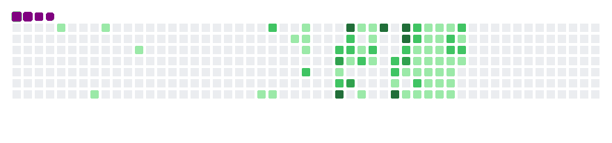

# 👨‍💻 Sahand Edrisi

  <a href="https://sahand-edrisi.ir/">🌐 View My Portfolio</a> •
  <a href="https://sahand-edrisi.ir/CV/Sahand%20Edrisi%20CV's.pdf" download>
  📄 Download My CV
</a>

  

<!-- Typing animation -->

  

<!-- Hero GIF -->

  

---

## 🧩 About Me

I'm **Sahand Edrisi**, a passionate **Front-End Developer** dedicated to crafting modern, scalable, and visually stunning web applications. With expertise in **React.js**, **Next.js**, **TypeScript**, **Redux Toolkit**, and **TailwindCSS**, I thrive on turning complex ideas into seamless user experiences.

I've delivered real-world projects including **e-commerce platforms**, **movie discovery sites**, **blogs**, and **interactive browser games**. My approach emphasizes:
- **Clean, maintainable code** for long-term scalability
- **Intuitive UX/UI** with a focus on responsiveness and accessibility
- **Performance optimization** to ensure fast-loading apps
- **Collaborative workflows** using tools like **Git**, **GitHub**, and **Jira**

Whether working solo or in teams, I'm always exploring new tools to push the boundaries of frontend development.

---

## ⚙️ Tech Stack

---

## 🧰 Tools I Use Daily

---

## 💼 Experience

### 🧠 Rotikala Website — *Remote Front-End Developer (Feb 2025 – Sep 2025)*
> A large-scale e-commerce platform inspired by Digikala, featuring product catalogs, user accounts, and checkout flows.

- Built with **Next.js** and **Redux Toolkit** for state management
- Integrated APIs using **Axios** and **Thunk** for asynchronous operations
- Created reusable UI components with **TailwindCSS** and **Flowbite**
- Implemented advanced form handling with **React Hook Form**

### 🎬 Zavie — *Freelance Front-End Developer (May 2024 – Feb 2025)*
> A dynamic movie showcase platform with search, ratings, and trailers.

- Fetched data efficiently via **Axios**
- Managed state with **useState** and **useEffect** hooks
- Ensured responsive design using **Bootstrap** grid system
- Added interactive sliders with **Swiper.js**

### 💡 Innovation Center — *Freelance Developer (May 2023 – May 2024)*
> Developed various browser-based applications and tools.

- Created a **personal portfolio website** using HTML, SCSS, and JS
- Built a **responsive blog platform** with dynamic content loading
- Implemented a **Sudoku game** with pure JavaScript logic and algorithms

---

## 🧱 Projects

| Project | Description | Tech Stack | Links |
|---------|-------------|------------|-------|
| **Movie Website** | A responsive app for browsing and discovering movies with trailers and details | React, Axios, Bootstrap, Swiper | [GitHub](https://github.com/Sahand-Edrisi/movie-website) • [Live Demo](https://sahand-edrisi.github.io/movie-website/) |
| **Personal Website** | My portfolio showcasing projects and skills | HTML, SCSS, JS | [GitHub](https://github.com/Sahand-Edrisi/personal-web-site) • [Live Demo](https://sahand-edrisi.github.io/personal-web-site/) |
| **MyBlogs Website** | A clean, responsive blog platform for articles and posts | HTML, SCSS, JS | [GitHub](https://github.com/Sahand-Edrisi/myblogs-web-site) • [Live Demo](https://sahand-edrisi.github.io/myblogs-web-site/) |
| **Sudoku Table** | An interactive browser-based Sudoku puzzle game | HTML, CSS, JS | [GitHub](https://github.com/Sahand-Edrisi/sudoku-table) • [Live Demo](https://sahand-edrisi.github.io/sudoku-table/) |
| **Calculator** | A simple yet responsive web calculator app | HTML, CSS, JS | [GitHub](https://github.com/Sahand-Edrisi/calculator) • [Live Demo](https://sahand-edrisi.github.io/calculator/) |

---

## 💬 Fun Facts & Hobbies

- ☕ Coffee powers my late-night coding sessions
- 🎧 I code best to **instrumental** or **lo-fi** beats
- 🏋️‍♂️ Hitting the **gym** keeps me balanced and energized
- 📘 Committed to **personal development** and lifelong learning
- 🌍 Actively improving my **English** skills for global collaboration
- 💡 Weekly dives into new frontend libraries and trends

---

## 🐍 GitHub Snake

  

---

## 📫 Contact Me

  <a href="https://github.com/Sahand-Edrisi">GitHub</a> •
  <a href="https://sahand-edrisi.ir/">Website</a> •
  <a href="https://www.linkedin.com/in/sahand-edrisi/">LinkedIn</a> •
  <a href="mailto:sahand.edc@gmail.com">Email</a> •
  <a href="https://t.me/Sahand_edc">Telegram</a> •
  <a href="https://wa.me/989195812500">WhatsApp</a>

