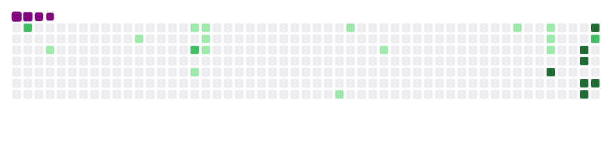

# 👨‍💻 Sahand Edrisi

  <a href="https://sahand-edrisi.ir/">🌐 View My Portfolio</a> • 
  <a href="https://sahand-edrisi.ir/CV/Sahand_Edrisi.pdf">📄 Download My CV</a>

  

---

## 🧩 About Me

I'm **Sahand Edrisi**, a **Front-End Developer** passionate about building modern, scalable, and visually polished web applications. I specialize in **React.js**, **Next.js**, **TypeScript**, **Redux Toolkit**, and **TailwindCSS**.

I’ve worked on multiple real-world projects — from **e-commerce platforms** to **movie websites**, **blogs**, and even **browser games**. My focus is always on:

* Clean and maintainable code
* Smooth user experience
* Performance optimization
* UI consistency and responsiveness

I enjoy working in collaborative environments using **Git**, **GitHub**, **Jira**, and modern development workflows.

---

## ⚙️ Tech Stack

---

## 🎯 Goals

My goal is to become a **Full-Stack Developer** with strong focus on:

* Modern web performance
* Clean architecture
* Scalable design patterns
* Developer‑friendly UX and workflows

---

## 🧰 Tools I Use Daily

---

## 💼 Experience

### 🧠 Rotikala Website — *Remote Front-End Developer (Feb 2025 – Sep 2025)*

> Large-scale e-commerce platform inspired by Digikala.

* Developed using **Next.js** + **Redux Toolkit**
* API integration with **Axios** and **Thunk**
* Built reusable UI components with **TailwindCSS** + **Flowbite**
* Applied **React Hook Form** for complex form handling

### 🎬 Zavie — *Freelance Front-End Developer (May 2024 – Feb 2025)*

> Movie showcase platform.

* Data fetching via **Axios**
* UI management using **useState** / **useEffect**
* Responsive design using **Bootstrap grid system**
* Integrated **Swiper.js** for modern sliders

### 💡 Innovation Center — *Freelance Developer (May 2023 – May 2024)*

> Multiple browser-based projects.

* **Portfolio website** (HTML, SCSS, JS)
* **Blog website** with responsive layout
* **Sudoku Game** implemented with pure JS logic

---

## 🧱 Projects

| Project              | Description                   | Tech Stack                      | Links                                                                                                                          |
| -------------------- | ----------------------------- | ------------------------------- | ------------------------------------------------------------------------------------------------------------------------------ |
| **Movie Website**    | Responsive movie showcase app | React, Axios, Bootstrap, Swiper | [GitHub](https://github.com/Sahand-Edrisi/movie-website) • [Live Demo](https://sahand-edrisi.github.io/movie-website/)         |
| **Personal Website** | Portfolio & blog              | HTML, SCSS, JS                  | [GitHub](https://github.com/Sahand-Edrisi/personal-web-site) • [Live Demo](https://sahand-edrisi.github.io/personal-web-site/) |
| **MyBlogs Website**  | Responsive blog platform      | HTML, SCSS, JS                  | [GitHub](https://github.com/Sahand-Edrisi/myblogs-web-site) • [Live Demo](https://sahand-edrisi.github.io/myblogs-web-site/)   |
| **Sudoku Table**     | Browser-based Sudoku game     | HTML, CSS, JS                   | [GitHub](https://github.com/Sahand-Edrisi/sudoku-table) • [Live Demo](https://sahand-edrisi.github.io/sudoku-table/)           |
| **Calculator**       | Responsive calculator app     | HTML, CSS, JS                   | [GitHub](https://github.com/Sahand-Edrisi/calculator) • [Live Demo](https://sahand-edrisi.github.io/calculator/)               |

---

## 💬 Fun Facts & Hobbies

* ☕ Coffee is my coding fuel
* 🎧 I focus best while listening to **instrumental / lo-fi music**
* 🏋️‍♂️ I regularly go to the **gym** and enjoy improving my physical strength
* 📘 I actively work on **personal development** and self-growth
* 🌍 I spend time **studying English** and improving my language skills
* 💡 I love exploring new frontend tools and libraries every week

---

## 📊 GitHub Stats

  

  

---

## 🐍 GitHub Snake

  

---

## 📫 Contact Me

  <a href="https://github.com/Sahand-Edrisi">GitHub</a> • 
  <a href="https://sahand-edrisi.ir/">Website</a> • 
  <a href="https://www.linkedin.com/in/sahand-edrisi/">LinkedIn</a> • 
  <a href="mailto:sahand.edc@gmail.com">Email</a> • 
  <a href="https://t.me/Sahand_edc">Telegram</a> • 
  <a href="https://wa.me/989195812500">WhatsApp</a> • 

